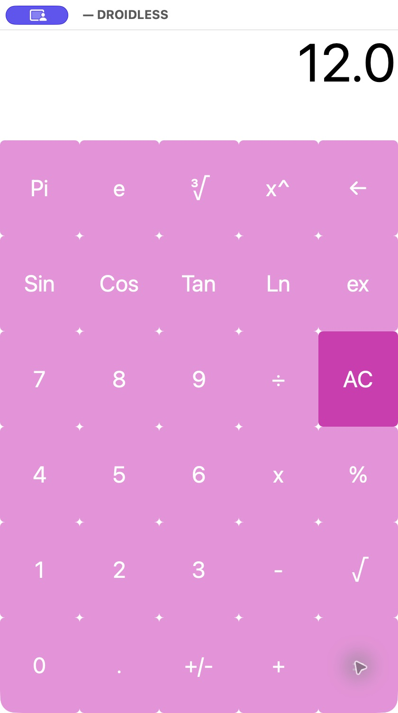
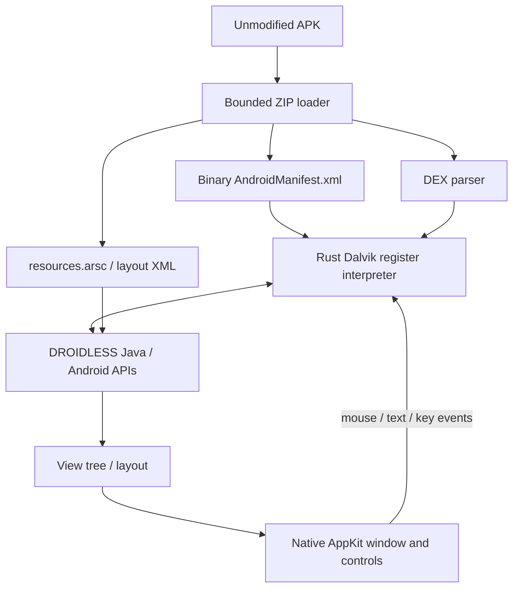

# DROIDLESS

**Run Android apps without Android.**

[](https://github.com/OthmaneBlial/droidless/releases/latest)

[Project site](https://othmaneblial.github.io/droidless/) ·
[Documentation](https://othmaneblial.github.io/droidless/docs.html)

DROIDLESS is an experimental Android compatibility runtime written in Rust.
It executes DEX bytecode itself, supplies a small Java/Android API subset,
inflates APK layouts, and renders widgets in a native macOS window.

**A real, unmodified third-party calculator is interactive.** KasCalc 1.0 runs
its own calculation and click-listener bytecode through DROIDLESS. Native mouse
clicks on `7`, `+`, `5`, `=` produced `12.0`; multiplication and square root
also worked. This is a verified subset, **not broad Android compatibility**.



No Android Emulator, Android VM, ART, Dalvik library, browser renderer or hidden
Android installation participates in execution. Android SDK tools compile our
test APKs only; they are not runtime dependencies.

```sh
cargo build --release --locked
sh tools/fetch-kascalc.sh
# macOS native desktop window
target/release/droidless artifacts/apks/KasCalc.apk
```

Compilation needs Rust and, on macOS, Apple's Command Line Tools. Linux can use
the headless code path; no Linux build/UI validation is claimed yet.
The [v0.1.0 release](https://github.com/OthmaneBlial/droidless/releases/tag/v0.1.0)
also provides a tested macOS ARM64 CLI archive and SHA-256 checksum. It has no
Apple developer signature or notarization.

```sh
target/release/droidless inspect app.apk
target/release/droidless manifest app.apk
target/release/droidless dex app.apk
target/release/droidless classes app.apk
target/release/droidless methods app.apk
target/release/droidless resources app.apk

# Input reaches the APK's own listeners; actual View state is returned as JSON
target/release/droidless run --headless artifacts/apks/KasCalc.apk \
  --click 7 --click + --click 5 --click = --stats
target/release/droidless inspect-ui fixtures/generated/counter.apk
# Current source: explicit Activity navigation (authored conformance fixture)
target/release/droidless run --headless fixtures/generated/intents.apk \
  --click "Open detail" --back

# CI is LOCAL ONLY. No GitHub workflows; Actions disabled on source repository.
sh tools/ci.sh
python3 tools/compatibility.py
```

## Architecture



Three crates: `droidless-formats` owns binary parsers; `droidless-runtime` owns
execution, heap, framework and Views; `droidless` owns CLI/platform integration.
[Architecture and decisions](docs/architecture.md).

## Current compatibility

| Capability | Evidence / boundary |
|---|---|
| APK, binary XML, resources.arsc | Real APKs and malformed-input tests; default resource configuration |
| DEX 035–040 | Headers/digests/IDs/class data/code/try handlers; annotations/debug partial |
| Register interpreter | Moves, constants, branches, switches, numeric operations, arrays, fields, calls, casts, explicit and implicit Java throw/catch |
| Object model / GC | Inheritance, dispatch, static initialization, strings/wide values, handle-based mark/sweep |
| Activity / Intents | Launcher discovery; explicit same-APK navigation, typed extras, finish/Back, lifecycle and preserved screen state (current source) |
| UI | TextView, Button, EditText, LinearLayout, FrameLayout; approximate styling/measurement |
| Input | Native KasCalc mouse callbacks; native Counter text/key callbacks; clean lifecycle close |
| macOS ARM64 | Actual native window and click evidence |
| Linux | Headless path; native GUI not implemented, build not verified |
| Storage, timers, networking | Not implemented yet |
| AndroidX, Compose, JNI, JIT, games | Future compatibility work |

Unsupported execution methods/opcodes fail with method, DEX module and PC.
[Exact API/opcode scope and limitations](docs/compatibility.md).

## Tested APKs

| APK | Origin | Proven scope |
|---|---|---|
| KasCalc 1.0 | [Independent release](https://github.com/KasRoudra/simplecalculator/releases/tag/v1.0) | Launches/renders/responds to native clicks; ten headless arithmetic/input scenarios |
| SmallestAPK | [Independent sample](https://github.com/krossovochkin/SmallestAPK) | Original signed APK executes its Activity and creates the expected TextView |
| Counter | DROIDLESS [Java/XML fixture](examples/counter/MainActivity.java) | Native text/key callbacks and clean close; resources and VM conformance |
| Intents | DROIDLESS [Java/XML fixture](examples/intents/MainActivity.java) | Native screen transitions, preserved text, Back override and clean root finish; typed extras/lifecycle tests |

KasCalc is fetched and SHA-256 checked, never recompiled, patched, repackaged or
redistributed. Custom fixtures are kept separate and do not prove arbitrary APK
compatibility. [Catalog](compatibility/catalog.json), [verification](docs/verification.md).

## Development

```sh
sh tools/ci.sh
# Optional fixture rebuild; normal tests need no Android SDK
python3 tools/build-fixtures.py --sdk "$ANDROID_SDK_ROOT"
# Optional unsigned development bundle
sh tools/macos-app.sh
```

Tracing: `--trace-bytecode`, `--trace-methods`, `--trace-framework`,
`--trace-lifecycle`. `--stats` / `--heap-stats` report real counters and elapsed
time. `--click TEXT`, `--key CHARACTER`, `--back`, `--headless` and `inspect-ui` support
repeatable experiments. [VM](docs/dex-vm.md), [framework/UI](docs/framework.md),
[security](docs/security.md), [roadmap](docs/roadmap.md).
Escape delivers Back in the native window. Navigation is available on main;
the published v0.1.0 archive retains its documented earlier scope.

This prototype is not a security sandbox. Guest filesystem/network/native code
and process APIs are unavailable; parser/VM limits do not replace OS isolation.
Use trusted APKs. Apache-2.0 for DROIDLESS; third-party artifacts retain their licenses.
