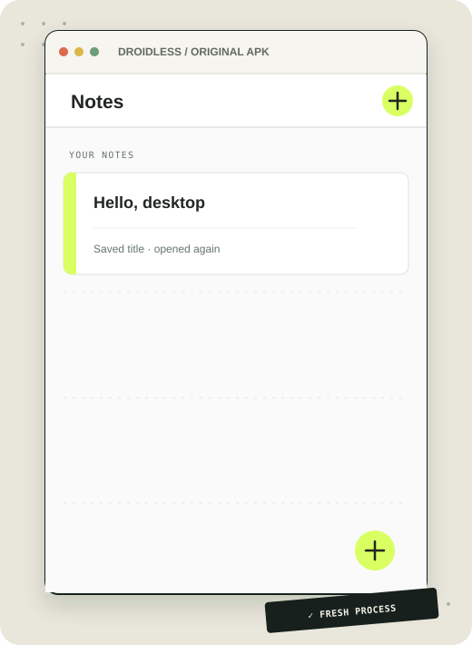
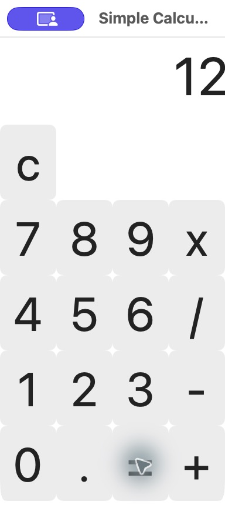
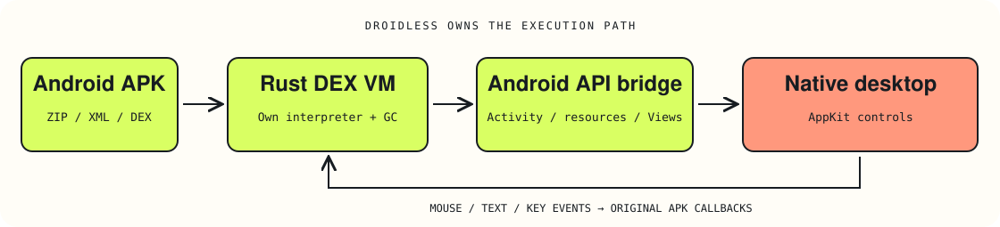

<div align="center">


<br>

[](https://github.com/OthmaneBlial/droidless/releases/latest)
[](rust-toolchain.toml)
[](LICENSE)
[](tools/ci.sh)

**[🌐 Explore the website](https://othmaneblial.github.io/droidless/)** ·
**[📖 Open the runtime notebook](https://othmaneblial.github.io/droidless/docs.html)** ·
**[📦 Grab v0.1.0](https://github.com/OthmaneBlial/droidless/releases/tag/v0.1.0)**

</div>

## 👋 Meet the little runtime with a big idea

Take an Android APK. Execute its own bytecode. Give it a native desktop window.

**DROIDLESS is an experimental Android compatibility runtime, written in Rust.**
It owns the DEX interpreter, managed heap, Android API bridge, resource system
and View model. A small AppKit bridge supplies the macOS controls.

No Android Emulator. No Android VM. No ART or borrowed Dalvik engine.
No browser renderer or hidden Android installation. Android SDK tools compile
our authored test APKs only; they do not participate in execution.

> 🧭 A working slice of Android, one real APK at a time. Compatibility is narrow;
> unsupported methods and opcodes report errors.

## 📓 A public notes APK, opened in DROIDLESS

The unmodified [Notepad 1.0.0 release](https://github.com/MohMah/android-notepad/releases/tag/v1.0.0)
opens its Notes screen and editor. A headless run taps **＋**, enters
`Hello, desktop`, and confirms the text in the APK's editable View tree.

<div align="center">

<p><sub>Illustrated from the 390 × 844 View snapshot; this is not a native-window capture.</sub></p>
</div>

The original APK's SHA-256 is checked by `sh tools/fetch-notepad.sh`; DROIDLESS
does not patch or redistribute it. After Back, the Notes list shows the saved
title; a fresh process reopens with that title still visible. Native-window
interaction and visual fidelity remain unverified. [Exact evidence and limits](docs/verification.md#current-source-public-notepad-editor).

```sh
sh tools/fetch-notepad.sh
target/release/droidless run --headless --ephemeral --size 390x844 \
  --click "＋" --input "Hello, desktop" artifacts/apks/notepad-v1.0.0.apk
```

## 🧮 The native calculator milestone

The independently published [Simple Calculator 1.0](https://github.com/swiftugandan/Simple-Android-Calculator/tree/3ba860b281eba34f144e4e75115f0c0a06bced31)
also runs unmodified. Original APK clicks produce `7 + 5 = 12`, `8 × 8 = 64`
and `9 / 3 = 3` in a native macOS window.

<div align="center">

<p><sub>Actual native capture · 192 × 400 logical viewport · earlier calculator proof.</sub></p>
</div>

Its upstream artifact is pinned and SHA-256 checked, never rebuilt or repackaged,
and not redistributed. Styling, table layout and complete numeric behavior remain
incomplete or unverified. [Calculator evidence](docs/verification.md#current-source-neutral-public-calculator).

## 🚀 Give it a spin

Build with **Rust 1.95.0** and Apple's **Command Line Tools** on macOS:

```sh
git clone https://github.com/OthmaneBlial/droidless.git
cd droidless
cargo build --release --locked
sh tools/fetch-notepad.sh
# Notes → editor → typed title 👋
target/release/droidless run --headless --ephemeral --size 390x844 --click "＋" \
  --input "Hello, desktop" artifacts/apks/notepad-v1.0.0.apk
```

The [v0.1.0 release](https://github.com/OthmaneBlial/droidless/releases/tag/v0.1.0)
includes a locally tested macOS ARM64 CLI archive and SHA-256 checksum. The binary
has no Apple developer signature or notarization. Linux has a headless code path;
its build and native UI have not been verified.

<details>
<summary><strong>🔎 Prefer the terminal? Inspect, replay and trace.</strong></summary>

```sh
target/release/droidless inspect app.apk
target/release/droidless manifest app.apk
target/release/droidless dex app.apk
target/release/droidless classes app.apk
target/release/droidless methods app.apk
target/release/droidless resources app.apk

# Original APK listeners update the emitted JSON View tree
target/release/droidless run --headless --size 192x400 artifacts/apks/SimpleCalculator.apk \
  --click 7 --click + --click 5 --click = --stats

# Current source: authored multi-screen navigation fixture
target/release/droidless run --headless fixtures/generated/intents.apk \
  --click "Open detail" --back

# Current source: replay the authored timer without waiting
target/release/droidless run --headless --ephemeral fixtures/generated/scheduling.apk \
  --click "Start timer" --advance-ms 1500 --advance-ms 1500 --advance-ms 1500
```

Use `--trace-bytecode`, `--trace-methods`, `--trace-framework` or
`--trace-lifecycle` to follow execution. `--stats` / `--heap-stats` report real
counters and timings. `--click`, `--key`, `--back`, `--headless` and `inspect-ui`
support repeatable experiments. `--size WIDTHxHEIGHT` selects a 128–4096 logical viewport on each axis (default 420×720). **Escape delivers Back** in the native window.
Current source adds `--input TEXT` for the first visible EditText, per-package
preferences by default, `--data-dir APPS_ROOT` and `--ephemeral` for memory-only runs.
`--advance-ms MILLISECONDS` advances the deterministic clock for queued APK callbacks.

</details>

## ⚙️ Bytecode in. Native views out.



| Crate | Its job |
|---|---|
| `droidless-formats` | Bounded APK, binary XML, DEX and compiled-resource parsers |
| `droidless-runtime` | Register interpreter, objects, GC, lifecycle, framework APIs and Views |
| `droidless` | CLI, native macOS rendering and input bridge |

[Architecture & decisions](docs/architecture.md) · [DEX VM](docs/dex-vm.md) ·
[Framework & UI](docs/framework.md)

## 🧰 What's in the toolbox?

| Capability | Proven scope |
|---|---|
| 📦 APK / manifest / resources | Real APKs and malformed-input checks; default resource configuration |
| 🧠 DEX 035–040 | Headers, digests, IDs, classes, code and try handlers; annotations/debug partial |
| ⚡ Own register interpreter | Arithmetic, wide values, branches, arrays, fields, dispatch, managed call continuations and Java throw/catch |
| 🧹 Managed objects | Inheritance, strings, sticky class initialization and handle-based mark/sweep GC |
| 🪟 Native widgets | TextView, Button, EditText, LinearLayout, FrameLayout and bounded adapter-backed GridView; a targeted support-RecyclerView two-note path; approximate layout/style |
| 🖼️ Resources and images | Packaged XML pull events and typed XML attributes; PNG/JPEG/WebP through BitmapFactory and ImageView; four native image views confirmed in an authored fixture |
| 📝 Rich text/XML | Android spannable text and a bounded SAX parser subset exercised by an unmodified APK |
| 🖱️ Input | Native calculator clicks, Counter text/key callbacks, and real keyboard text in the public Notepad APK |
| 🧭 Activity navigation | Explicit same-APK Intents, typed Bundle extras, preserved Back stack, finish, Application observers and platform fragments without Views — current source |
| 📓 Persistent storage | Typed SharedPreferences and bounded SQLite support; two public Notepad notes appear after Back and a fresh process — current source |
| 🗂️ Java collections | Bounded HashSet/ArrayList/HashMap/basic LinkedHashMap, snapshot CopyOnWriteArrayList, immediate FIFO queues, indexed lists, guest equality, native map copying and live read-only Set/List views — current source |
| 🔎 APK classes | APK-local Class lookup, no-argument construction, initialization/access faults, primitive TYPE metadata and inherited field resolution — current source |
| 🌍 API profile | Fixed read-only Build.VERSION.SDK_INT = 21 for app version checks; partial framework support — current source |
| ⏱️ Scheduled callbacks | Main Handler/Looper/Message queue, delayed APK callbacks, cancellation and GC retention; native authored timer verified — current source |
| 🧵 Guest workers | Deferred DEX execution on a serial shared-heap host executor; queue/monitor waits/interrupt pass headless checks; main Handler results also verified natively — current source |
| 🛠️ Next up | Extend the public image viewer beyond static images and Back; gestures and slideshow remain ahead |

The published **v0.1.0 archive predates navigation, persistence, collections, scheduling and the new calculator demo**. Current source capability
is documented separately. AndroidX, Compose, JNI, networking, Linux native UI
and games remain future compatibility work. [Exact limits](docs/compatibility.md).

## 🧪 Tiny lab. Real bytecode.

| APK | Origin | What we observed |
|---|---|---|
| Simple Calculator 1.0 | [Pinned independent APK](https://github.com/swiftugandan/Simple-Android-Calculator/tree/3ba860b281eba34f144e4e75115f0c0a06bced31) | Three native arithmetic cases; seven headless cases |
| KasCalc 1.0 | [Independent release](https://github.com/KasRoudra/simplecalculator/releases/tag/v1.0) | Native calculations; ten headless arithmetic/input cases |
| SmallestAPK | [Independent sample](https://github.com/krossovochkin/SmallestAPK) | Original signed APK executes its Activity and creates the expected TextView |
| Counter | [Authored Java/XML fixture](examples/counter/MainActivity.java) | Native text/key callbacks, resources and VM conformance; nested FrameContract also passes on desktop Java |
| Intents | [Authored Java/XML fixture](examples/intents/MainActivity.java) | Native screen transitions, retained input, Back and lifecycle observers; headless snapshot registration, GC during transitions and callback fault cleanup |
| Preferences | [Authored Java/XML fixture](examples/preferences/MainActivity.java) | Native UTF-8 paste, save/restart/clear, typed values and package/path isolation |
| Collections | [Authored Java fixture](examples/collections/MainActivity.java) | Headless list/queue ordering, snapshot iteration across mutation/GC/worker writes, guest equality, read-only views and limits; same normal list, snapshot, map-copy and immediate queue contracts pass on desktop Java |
| Reflection | [Authored Java fixture](examples/reflection/ReflectionContract.java) | Class lookup/construction, primitive TYPE identities, guest faults and inherited fields; pure Java contracts pass on desktop Java. SDK profile field checks are compiled DEX evidence |
| Scheduling | [Authored Java fixture](examples/scheduling/MainActivity.java) | Native delayed timer/cancellation/finish and worker-to-main results; headless ordering, Message overrides, worker waits/interrupt, GC, errors and limits. [Exact scheduling scope](docs/threading.md) |
| Images and XML | [Authored Java/XML fixture](examples/images/MainActivity.java) | XML pull traversal, typed attributes, PNG/JPEG/WebP decoding and four native AppKit ImageViews. Unmodified SwpieView also opens selected-folder images in its native full-screen viewer |
| Activity results and folders | [Authored Java fixture](examples/results/MainActivity.java) | Actual request codes, copied return data, Back cancellation and native folder selection; stopped callers, GC and failure cleanup pass compiled checks. Bounded read-only document queries and streams are supported; writes and persistent grants remain open |
| Document images | [Authored Java fixture](examples/documents/MainActivity.java) and [SwpieView 1.3.2](https://f-droid.org/en/packages/org.voidptr.swpieview/) | Folder chooser → three thumbnails → JPEG/PNG/WebP full-screen viewer → Back, verified in native AppKit with the unmodified public APK. URI confinement, GC, links, oversized files and sort contracts pass compiled checks |
| Parcelable state | [Authored Java fixture](examples/parcels/MainActivity.java) | Actual guest writers/CREATORs, nested Bundles/lists/nulls, Unicode/wide values, isolated activity/result payloads, GC during source mutation and malformed-data/error cleanup |
| Photo grid | [Authored Java/XML fixture](examples/grids/MainActivity.java) | Guest BaseAdapter cells, auto-fit and four stretch modes, observer updates and native photo clicks with 64-bit IDs; disabled items ignore clicks and Refresh replaces seven photos with four |
| Widgets | [Authored Java contracts](examples/images/WidgetProbe.java) | Timed scrolling, manifest application metadata, listener overrides, virtual background dispatch and content-description retention; image accessibility labels verified in native AppKit |
| Notepad 1.0.0 | [Independent release](https://github.com/MohMah/android-notepad/releases/tag/v1.0.0) | Headless Notes list/editor, two-row SQLite save and fresh-process title retention; native AppKit typing and saving also verified |

Authored fixtures test implementation; they do not establish arbitrary APK
compatibility. [Evidence catalog](compatibility/catalog.json).

```sh
# CI lives on your machine. GitHub Actions stays disabled.
sh tools/ci.sh
sh tools/fetch-kascalc.sh # Earlier calculator regression APK
sh tools/fetch-simple-calculator.sh
sh tools/fetch-notepad.sh
sh tools/fetch-swpieview.sh
python3 tools/compatibility.py
```

Local checks cover formatting, builds, 83 Rust tests, Clippy and 4,096 seeded parser
mutations. Normal tests require neither an Android SDK nor an emulator.

<details>
<summary><strong>🔧 Rebuild fixtures or create a development app bundle</strong></summary>

```sh
python3 tools/build-fixtures.py --sdk "$ANDROID_SDK_ROOT"
sh tools/macos-app.sh
```

The bundle is unsigned and intended for local development.

</details>

## 🗺️ Next checkpoint: 50%

The **20% milestone** is demonstrated: an unmodified APK renders, accepts clicks,
executes its own logic and updates native UI without Android. This is a milestone
label, not a measurement of Android API coverage.

The next ambition is **50%**: move beyond calculators toward useful everyday
apps, with multiple screens, persistent data, lists, images and scheduled callbacks.
That target remains ahead of us. Every step needs executable evidence and a
clear compatibility boundary. [Follow the roadmap](docs/roadmap.md).

## 🔐 A small but important boundary

This prototype is not a security sandbox. Parser/VM limits do not replace OS
isolation. Current source grants isolated SharedPreferences storage plus a fixed
virtual `/proc/self/cmdline` response; general file, network, native-library and
process APIs are unavailable. Use trusted APKs.
[Storage behavior and limits](docs/storage.md).
[Security boundaries](docs/security.md).

---

<div align="center">

**Built in Rust. Powered by original APK bytecode. A little stubborn by design. 🤖**

DROIDLESS is Apache-2.0. Third-party artifacts retain their own licenses.

[Website](https://othmaneblial.github.io/droidless/) · [Documentation](https://othmaneblial.github.io/droidless/docs.html) · [Source](https://github.com/OthmaneBlial/droidless)

</div>
